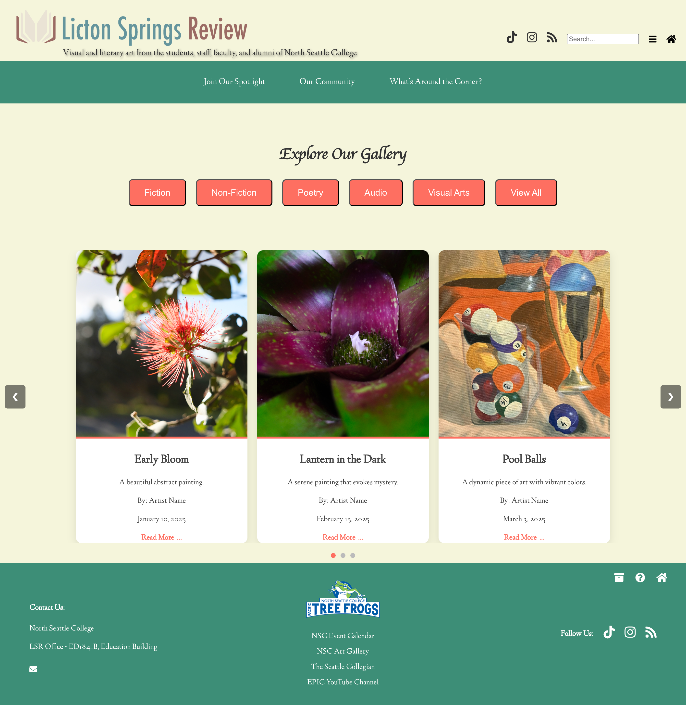

# LSRHomepageDesign-Alt
An alternative homepage design concept for the LSR website, built with React and modern UI principles.


## 🌟 Features
- Responsive and mobile-friendly design  
- Clean and modern UI  
- Built with React  
- Optimized for performance  


---


### **📌 About This Project**  
This design was created as an alternative homepage concept for the LSR website. While it was not selected as the final version, it showcases a unique design approach and front-end development skills.


---


## 📸 Screenshots  



---


### **🛠️ Technologies Used**  
- React  


---


### **🚀 Getting Started**  
Follow these steps to set up and run the project:

1. **Clone the repository**  
   ```sh
   git clone https://github.com/edalemiguel/LSRHomepageDesign-Alt.git
   ```
2. **Navigate to the project folder**  
   ```sh
   cd LSRHomepageDesign-Alt
   ```
3. **Install dependencies**  
   ```sh
   npm install
   ```
4. **Run the development server**  
   ```sh
   npm start
   ```

